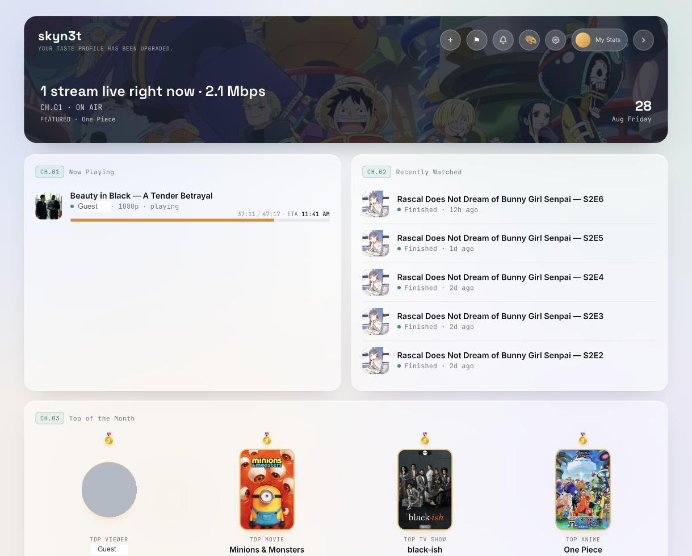
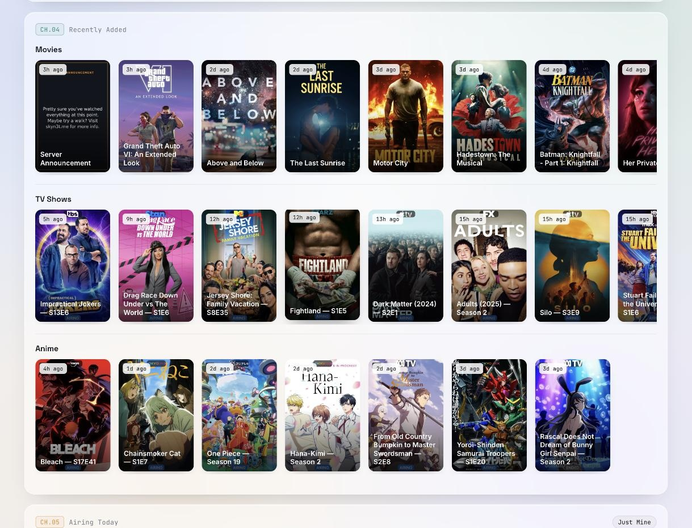
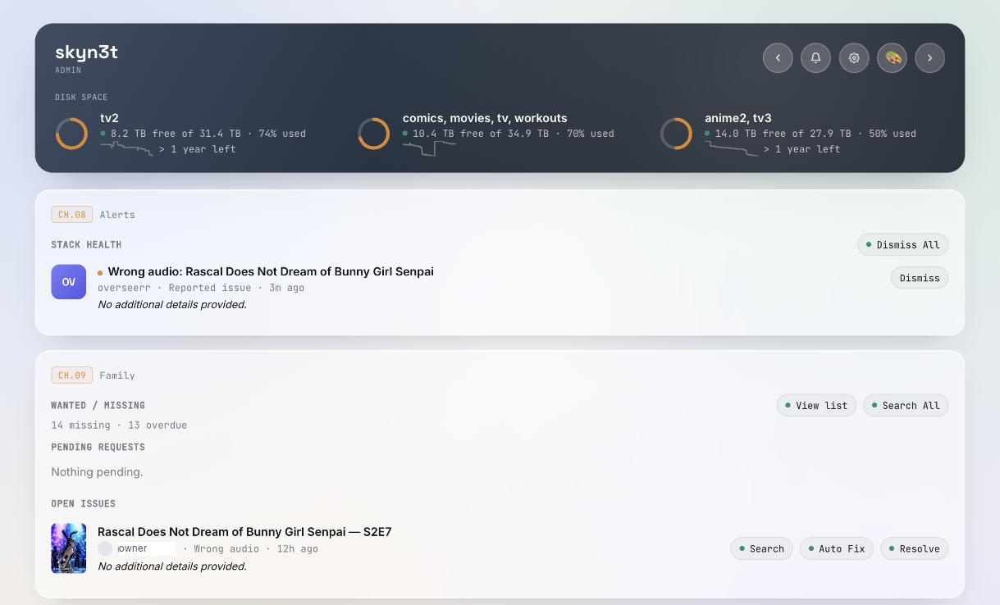

# Marquee

A self-hosted dashboard for your Plex family: live "Now Playing," recently added
(via Tautulli), today's episodes (Sonarr), upcoming releases (Radarr), and a
request UI backed by Overseerr/Jellyseerr — all behind Plex sign-in.

The server owner also gets `/admin` — a separate page (not visible to shared
users) for approving requests, resolving reported issues, searching Radarr/
Sonarr's indexers for a replacement release, managing the download queue,
and checking Prowlarr indexer health, all without opening each service's own
UI. It also includes owner-reviewed monthly recap emails with unsubscribe,
duplicate-send protection, send history, and a privacy-conscious security/
owner-action audit log.

## Screenshots

|                             Dashboard                             |                          Recently added                           |
| :----------------------------------------------------------------: | :-----------------------------------------------------------------: |
|  |  |

|                              Admin                              |
| :---------------------------------------------------------------: |
|  |

(Usernames and a few identifying details in these screenshots have been
replaced with placeholders — everything else is the app running for real.)

## 1. Configure

```bash
cd marquee
cp .env.example .env
git config core.hooksPath githooks
```

The last line enables a pre-commit hook that blocks commits containing
private/internal IP addresses — this repo is public, and `.env.example` has
leaked real LAN IPs into it before. Real config only ever belongs in `.env`,
which is gitignored.

Fill in `.env`:

| Variable | Where to find it |
|---|---|
| `PLEX_ADMIN_TOKEN` | Plex support article "Finding an authentication token" |
| `PLEX_MACHINE_ID` | Plex web app → Settings → General → scroll to bottom, or `GET /identity` on your server |
| `PLEX_CLIENT_ID` | Any random UUID you generate once — `node -e "console.log(crypto.randomUUID())"` — and never change |
| `TAUTULLI_API_KEY` | Tautulli → Settings → Web Interface → API Key |
| `SONARR_API_KEY` / `RADARR_API_KEY` | Settings → General → Security in each app |
| `OVERSEERR_API_KEY` | Overseerr/Jellyseerr → Settings → General → API Key |
| `PROWLARR_API_KEY` | Settings → General → Security (optional — only powers the admin page's indexer health check) |

The URLs default to `localhost` as a placeholder — set each one to wherever
that service actually lives (your LAN, another container, etc). Set
`SITE_NAME` if you want the dashboard to show your own name instead of
"Marquee".

## 2. Build and run

```bash
docker compose up -d --build
```

That builds the image and starts the container, listening on `:4000`. As
long as your other apps are reachable over your LAN (they don't need to be
on the same Docker host or network), no Docker networking tricks are needed.

**Point your reverse proxy** (nginx, Caddy, Traefik, …) at `localhost:4000`
for your domain, with HTTPS terminated there as usual. Once it's actually
served over HTTPS, set `COOKIE_SECURE=true` in `.env`.

To update after changing code:

```bash
docker compose up -d --build
```

Logs: `docker compose logs -f marquee`

## 3. How sign-in works

This uses the same "Sign in with Plex" flow Overseerr uses: your account
requests a PIN from plex.tv, the user approves it on `app.plex.tv`, and the
backend checks that their Plex account is either the server owner or a user
you've shared libraries with. No passwords are stored by this app — Plex
handles auth entirely.

## 4. Notes

- Sessions persist to a SQLite file (`connect-sqlite3`, mounted at `./data`),
  so restarts and rebuilds don't log the family out.
- Requests placed through the dashboard are attributed to the signed-in
  family member when their Plex account has a matching Overseerr user
  (matched via Overseerr's `plexId` field); otherwise they fall back to the
  API key's default account.
- The Plex image proxy (`/api/plex/image`) only forwards paths shaped like
  actual Plex thumb/art URLs — worth knowing if you're extending it.
- All the widgets poll on page load; "Now Playing" also refreshes every 15s.
  Adjust intervals in `public/app.js` if you want them snappier or lighter.

## 5. Database backups & restore

Every SQLite file in `./data` (sessions, notices, alerts, sign-in history,
push subscriptions, recap unsubscribes/reminders/sends, audit log) is backed
up automatically once a day by `lib/dbBackup.js`, into
`data/backups/<timestamp>/`. Each database gets a `PRAGMA integrity_check`
before it's backed up — one that fails is skipped and flagged, not copied.
Backups older than 14 days are pruned automatically. Trigger a backup
on-demand from Settings → System Status → "Run Backup Now" (owner only), or
by calling `POST /api/owner/db-backups/run`.

There's no restore button — restoring means overwriting live data, which
shouldn't be a single accidental click away. To restore a backup manually:

```sh
docker compose stop skyn3t
cp data/backups/<timestamp>/*.sqlite data/
docker compose start skyn3t
```

This restores every database from that backup together. To restore only
one database (e.g. just `notice.sqlite`), copy that single file instead of
the whole set — but be aware other databases will then be out of sync with
whatever point in time you picked, since they weren't restored together.

## Project structure

```
marquee/
  Dockerfile
  docker-compose.yml
  server.js              # entrypoint, serves / and /admin
  routes/
    auth.js               # Plex OAuth + session
    plex.js                # now playing + image proxy + library search
    tautulli.js            # recently added, recently watched, top of month
    sonarr.js               # airing today, release search, queue
    radarr.js                # releasing soon, release search, queue
    overseerr.js              # search/discover, request, issues, webhook
    downloads.js               # qBittorrent/SABnzbd queue + owner actions
    owner.js                    # system status, sign-in log, wanted/missing
    recap.js                    # monthly recap review/send/unsubscribe/history
    prowlarr.js                  # indexer health
  lib/
    recapSendLog.js             # per-recipient/month send state + attempts
    auditLog.js                 # security and owner-action event history
  public/
    index.html            # family dashboard
    admin.html              # owner-only control page
    style.css                # shared visual theme
    shared.js                 # utilities used by both pages
    app.js                      # dashboard-only logic
    admin.js                     # admin-page-only logic
```
